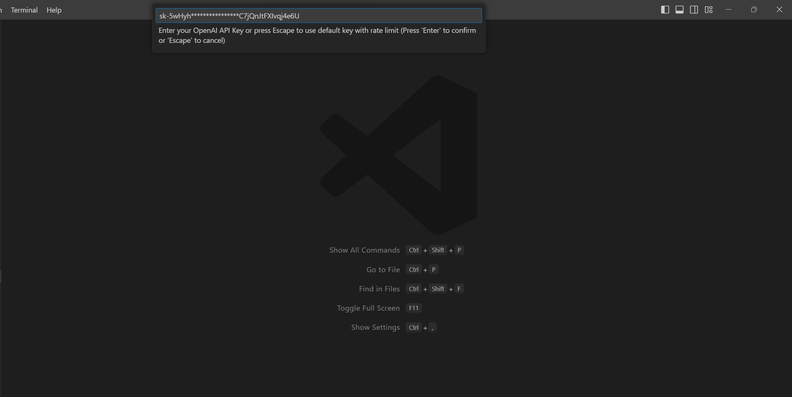
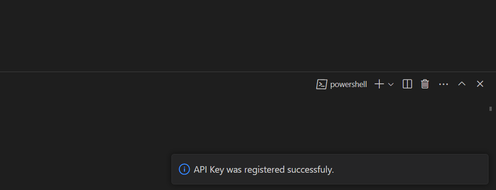
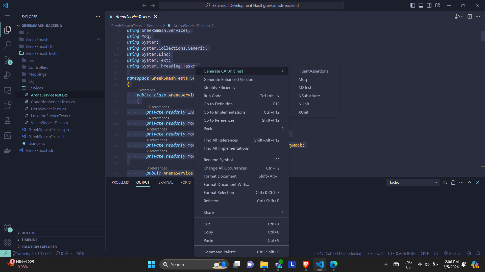
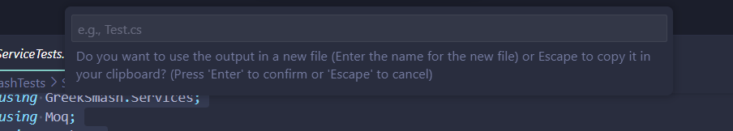
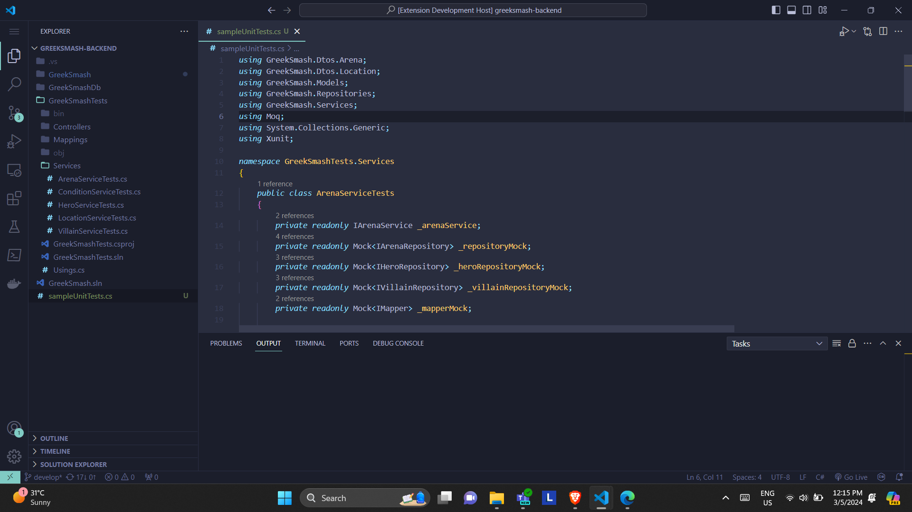
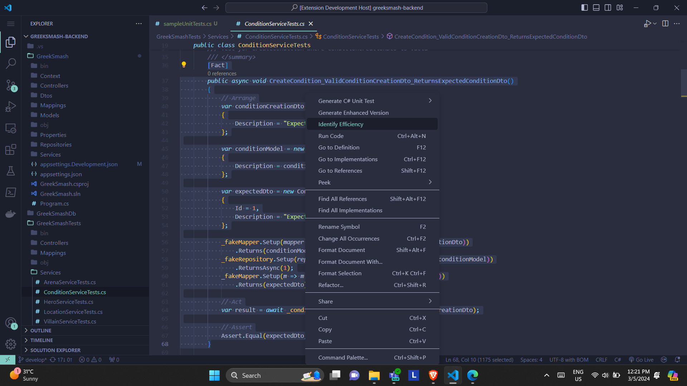
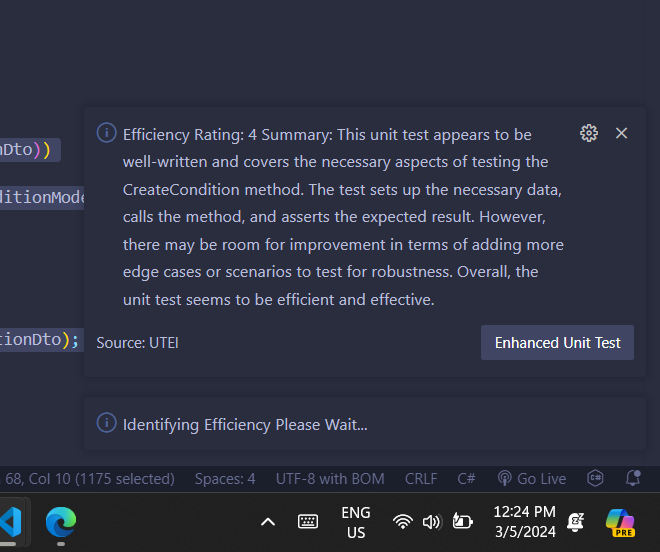
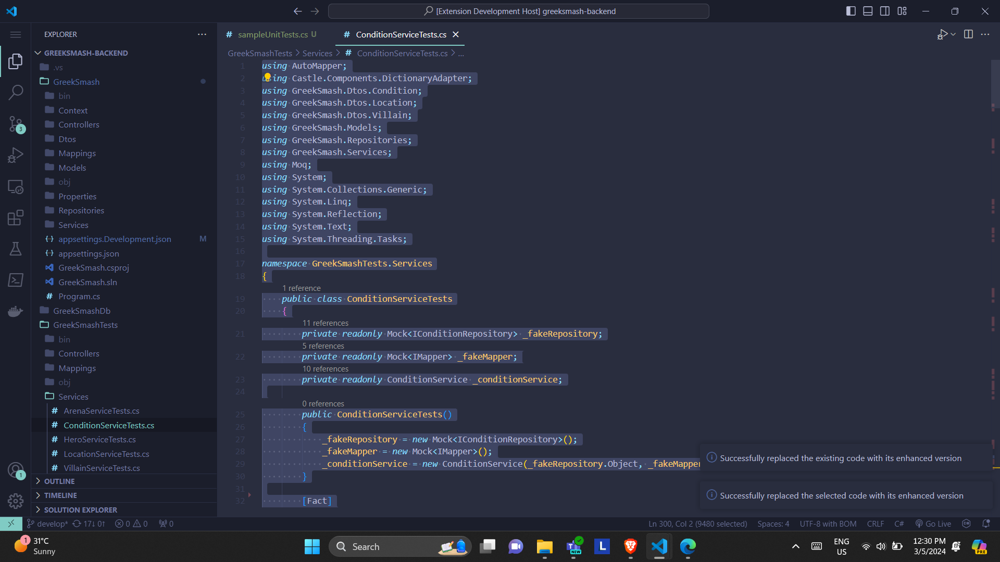

# 
**TestMate**

**Streamlining Unit Testing with AI as a Visual Studio Code Extension**

As software developers, we understand the importance of efficient unit testing. That’s why we’ve created TestMate, a powerful Visual Studio Code extension designed to enhance your testing process. Here’s how it works:

1. High-Quality Unit Test Generation: TestMate integrates OpenAI to automatically generate high-quality unit tests for your code. Say goodbye to manual test writing – let AI do the heavy lifting!

2. Efficiency Assessment: Not sure if your existing unit tests are up to par? TestMate analyzes your test suite and provides insights into its efficiency. Identify areas for improvement and optimize your testing strategy.

3. Enhanced Test Versions: TestMate doesn’t stop at analysis – it also suggests enhanced versions of your existing unit tests. Elevate your test coverage and reliability effortlessly.

Whether you’re a seasoned developer or just starting out, TestMate is your ultimate testing companion. Try it today and experience faster, more efficient unit testing! 🚀

## 
**How it works!**

### 
**(Optional) Setup API key**

This step is specifically for users who already have an existing subscription to ChatGpt. You have the option to use your own API key or utilize our free version. Or you can get your API Key ready from here: [OpenAI](https://platform.openai.com/account/api-keys)

Click CTRL + SHIFT + P  --->>> Type and Select Enter OpenAI Api key

Enter your API key

This will show after successfully inputing your API key

###
**Generating Unit Tests**

Our system intelligently analyzes entire code files, considering the code structure, function signatures, and underlying logic. It automatically generates comprehensive unit tests that cover various scenarios within the entire file. This holistic approach ensures thorough test coverage, minimizing the risk of undetected defects.

CTRL + A (To select the whole text Or you can just select a certain function or method that you want to generate a unit tests) 
 --->>> Right Click --->>> Select Generate Unit Test --->> Select what framework you will use
 

After that you will be prompt to either create a new file or just copy the unit tests in your clipboard.

And it will automatically create a new file for you with the unit tests on it.

###
**Identifying Efficiency**

Our system incorporates advanced techniques to evaluate the efficiency of unit tests. By assessing various factors, we provide developers with valuable insights into the quality and effectiveness of their test suites. Here are the key components of our unit test efficiency identification feature:

First Highligh the unit test you want to be rated --->>> Right Click --->>> Select Identify Efficiency

Upon analyzing a unit test, our system assigns a rating on a scale from 1 to 5, with 5 being the most efficient and 1 indicating room for improvement. The rating considers multiple dimensions, including code coverage, assertion quality, and test case diversity. Developers can quickly gauge the overall effectiveness of their existing unit tests based on this rating. Alongside the rating, TestMate provides a concise summary that explains the rationale behind the assessment. The summary highlights specific strengths and weaknesses observed in the test suite.

If the rating is below 4, it will generate an enhanced version of the unit test and automatically update your code. If the rating is 3 or above, no further unit test will be generated.

###
**Generate Enhaced Version**

TestMate offers an optional feature for users who prefer optimizing their entire code file at once instead of generating individual unit tests. This streamlined functionality enables comprehensive improvements across the codebase in a single operation, minimizing the need for manual intervention.

Highlight the code you want to enhance --->>> Click Generate Enhance Version

And it will automatically update your code

And that concludes the process of our extension. We appreciate your time and effort in working through this task. To further enhance this extension, we kindly request that you take a moment to answer our survey. Your feedback will help us improve the system. Thank you! 😊

[Survey Link](https://forms.office.com/r/TsvLWR24fk)

**Enjoy and happy coding!**
